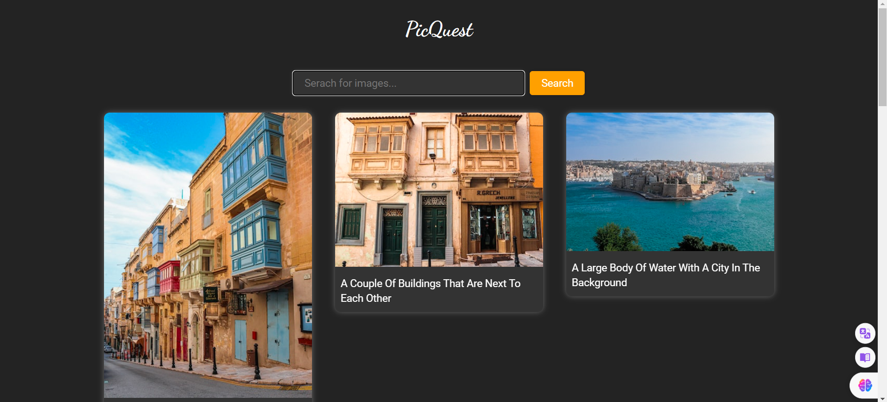

# Image Search Web App

Developed a dynamic image search web application using HTML, CSS, and JavaScript. The app allows users to search and discover images through the Unsplash API, featuring a user-friendly interface with a dark mode option.

## Features

- Image search functionality powered by Unsplash API.
- User-friendly interface with a dark mode.
- Responsive design for seamless use on various devices.

## Screenshots



## Getting Started

1. Clone the repository:

   ```bash
   git clone https://github.com/your-username/image-search-app.git
   ```

2. Open `index.html` in your preferred web browser.

## Dependencies

- [Unsplash API](https://unsplash.com/developers)

## License

This project is licensed under the MIT License - see the [LICENSE](./LICENSE) file for details.
